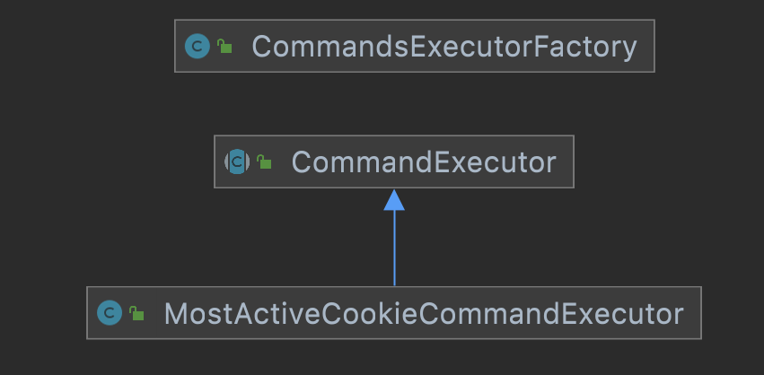
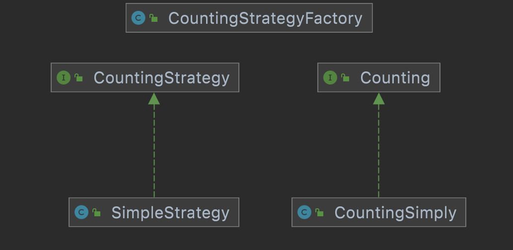
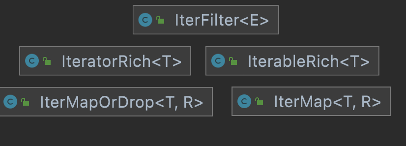
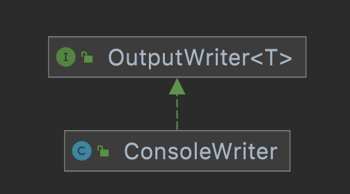
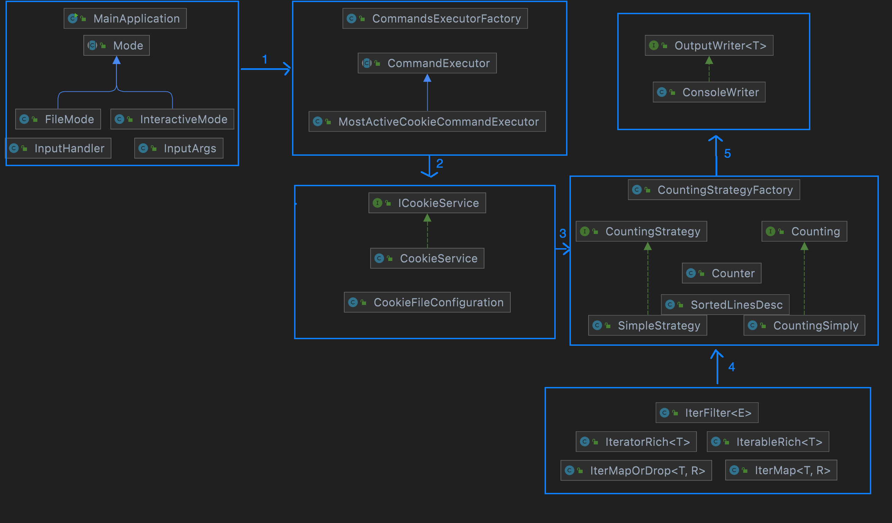

# QuantCast_Assignment
 
# Most Active Cookie

Cookie analyzer parse cookies given in csv file and gives back required output as per customer input filters

##Technologies used

* Java
* Unit tests written with [JUnit 5](https://junit.org/junit5/)
* Integration tests written with [JUnit 5](https://junit.org/junit5/)
* Code coverage reports via [JaCoCo](https://www.jacoco.org/jacoco/)
* A Maven build that puts it all together
* Docker
* Shell Scripting

## Running the tests

### Docker Way
* Go to `QuantCast_Assignment` folder


* Execute below commands
  ```
  docker build -t myproj . 
  
  docker run -ti -v /path/to/inputfiles:/test myproj
  ```

* Replace `/path/to/inputfiles` with folder path to input files

  * This will mount the volume in Docker container so docker can access the input files
  

* Please Enter the command and filename and date as below
  ```
  most_active_cookie -f input1.csv -d 2018-12-09 -h
  ```
* `most_active_cookie` is a command for fetching most active cookie
* `-f input1.csv` read the file from _/path/to/inputfiles_ folder which was mounted in docker
* `-d 2018-12-09` accepts the date in yyyy-mm-dd format
* `-h` **[optional]** Used for skipping the first line if header is present
*  `-failfast` **[optional]** Used for skipping the bad data and proceed with other records in the file

### ShellScript 

* `./entry.sh -f input1.csv -d 2018-12-09` 
* Please use above command from shell script
* NOTE: `-h` and `-failfast` not supported in shell script

### Execute from IDE
* Pass below  options as arguments to `MainApplication`


* `-f input1.csv` read the file from _/path/to/inputfiles_ folder which was mounted in docker
* `-d 2018-12-09` accepts the date in yyyy-mm-dd format
* `-h` **[optional]** Used for process first line if header is not present
* `-failfast` **[optional]** Used for skipping the bad data and proceed with other records in the file


## QA tests

* To run the unit tests, call `mvn test`
* To run the integration tests as well, call `mvn verify`
* Code coverage reports are generated when `mvn verify` (or a full `mvn clean install`) is called.
  Point a browser at the output in `target/site/jacoco-both/index.html` to see the report.

## Core Logic
###Based on usage
* Used Strategy pattern to pick the appropriate algorithm

| Load full file   | Lazy Load | Database ( [trie](https://en.wikipedia.org/wiki/Trie) ) | 
| :---:         |     :---:      |     :---: |
| O(logn)   | O(n)     | O(logn)    |
| Binary search      | Linear Search       | Trie      |
| Used in case of small files     | Used in case of large files       | Used for fetching most active record for(day/month/year/hour)      |

## Design 

###Command pattern
* Used to add new commands like `least_freq_used` etc without modifying existing code (Open-Close principle)



###Strategy Pattern
* Used Strategy pattern to pick the appropriate algorithm



###Iterator Pattern
* Used Iterator Pattern to decide on `failfast` or `failsafe` and to decide on lazy load or load all at once


###Output
* Output stream can be changed without changing existing code


###Flow



